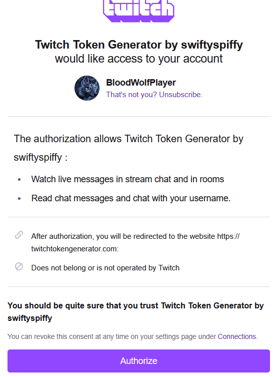

# Dead By Daylight Twitch Reader Container

## Overview
This Program can be used to run instances of the "DbD perk slot machine" from 3stadt **(https://github.com/3stadt/dbd_perk_slot_machine/)** semi-locally on your machine.
Allowing you to run survivor and killer slots on your display of choice with transparent windows for easy insertion into OBS, to play with it as an overlay or to share it with friends.

Using the already built in perk selector from 3stadt on their website, you can specify which perks appear ( or do not appear) in the slot machine, per survivor and killer.

Also included is a Twitch intergration, which connects to your Twitch chat to look out for the !Gamble or !Gambling command to let your chat fulfill their desire to spin the slots in hopes of getting you (and possibly your friends) either the perks of your dreams or supply you with the worst evil known to man. 

## Files
- **TwitchReader.cs**: Contains the `TwitchReader` class responsible for connecting to the Twitch API and processing data.
- **Program.cs**: Currently used to start the program, exciting is it not?.
- **DBDElectronGambler.js**: Electron based container for the DbDGambler.
- **DeadByDaylight.csproj**: Project file that includes configurations for building the application.

## Setup Instructions
At the moment, you need following installed on your Computer:

- **Node.js** (Download from their Website https://nodejs.org)
- **Electron** (Currently needed globally. Run "npm install -g electron" in a Terminal)
- **WebSocket** (Install it in your folder where you keep the program, using "npm install ws" in a Terminal in there.)

You will also need to provide a Twitch OAuth token which the locally hosted instance will use to listen to chat, you can make one here: https://twitchtokengenerator.com/

 Click me if you need some help to set the token up!

**Needed Permissions**

**chat:read** and **user:read:chat**

The twitch popup should look like this roughly:

Afterwards, you can grab the "Access token" by pressing the big copy button and paste it into the settings.txt.

Tokens are powerful, so do not give it too much power. If something does happen to the token, or you want it disabled, you can do it on the same website.

My Program will **not** save the token on the internet. It will only save it locally so you dont have to re-type it in every time. It will only reside inside settings.txt with all other configurations.

## Usage
To be updated when GUI is ready.

For now, you can run the Program either via Terminal (open the folder with the program and run "Dotnet run" inside a Terminal in that folder.) or via the latest provided Release and the .exe located within.
This will open a Terminal, and on first start or missing file, create a settings.txt for you at the working folder.

Fill out those settings with your Twitch username, Token, Screen settings and URLs to certain perks (if you dont want to use the default where everything is enabled).
There you can also activate the Killer Spinner or amount of Survivor spinners.

Provided is also an option to change out the !Gamble command with a command of your choosing. (Example, ?!Salad)

!Gambling will always remain active, as a fallback and for the memes.

Do note, the Command can also be part of a whole message, aslong as its connected ("Lets go !Gambling" will also work).
